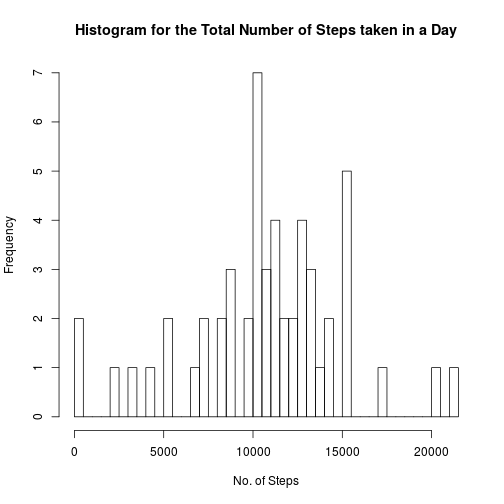
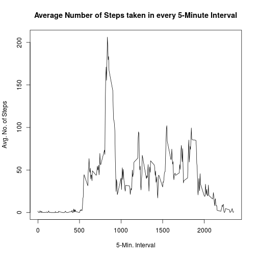
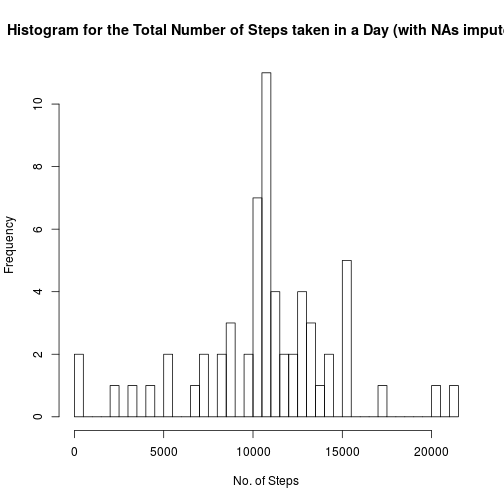
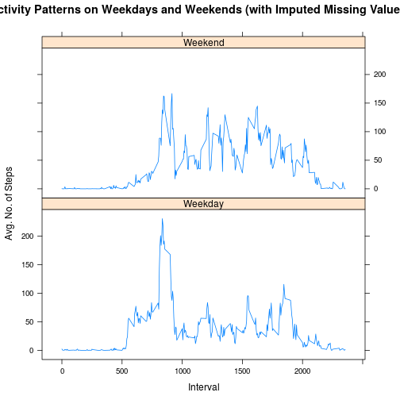

This is my submission for the first peer assessment of the Reproducible Research course.

#1. Number of steps taken per day
 

The mean and median of the total number of steps taken per day are 1.076619 &times; 104 and 1.0765 &times; 104, respectively.

#2. Average daily activity pattern
 

The interval with the maximum number of steps is 835.

#3. Missing values

The number of missing values in the data is 2304.

 

The mean and median of the total number of steps taken per day with data imputation are 1.076619 &times; 104 and 1.076619 &times; 104, respectively.

Thus, using interval means as imputation values yields post-imputation mean and median values that are very close to their pre-imputation counterparts.

#4. Differences in activity patterns between weekdays and weekends
 
